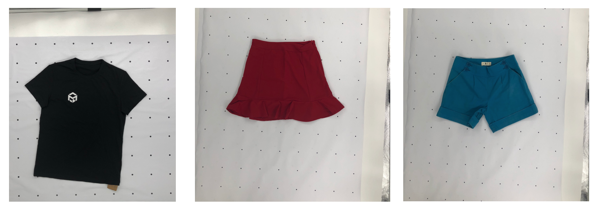
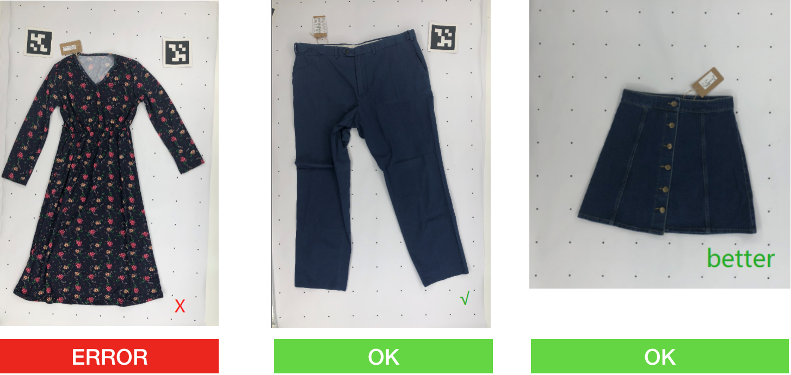
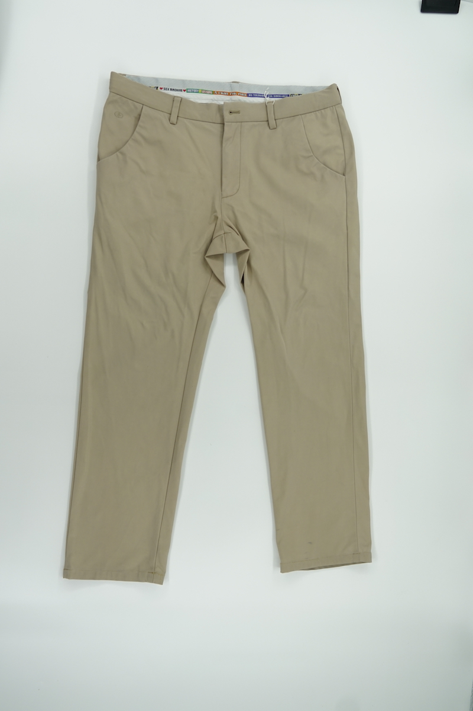

# MeasureAI User Guide

## Requirements

1. MeasureAI Account
2. MeasureKit Background Mat

Contact our sales representative for a [free trial](https://measure.productai.com/trial) to receive an account and MeasureKit demo. 

## Getting Started

MeasureAI supports taking photos via mobile smartphone, or with a desktop or laptop PC. 

The clothing should be laid flat on the MeasureKit background mat, with smartphone or USB webcam placed directly above the clothing. 

For best results, the photo should capture the full clothing, as close as possible. 

#### Mobile 

MeasureAI can be used with any modern smartphone. Just login to [MeasureAI](https://measure.productai.com/measure) from your smartphone device. 

1. Lay Background Mat on a flat surface. It's easiest to place this on the floor. Place clothing on top of the Background Mat. See [Taking Photos](#taking-photos) for correct placement.
2. Login to [MeasureAI](https://measure.productai.com/measure) from your device. 
3. Tap `Upload Photo` to take a picture with your smartphone. 
4. Click `Submit` and wait for MeasureAI to return results. 

#### Laptop or Desktop PC

MeasureKit comes with a USB Webcam, and camera stand for using with a desktop or laptop PC. 

1. Plug USB Webcam into a Windows PC or Mac OSX system. 
2. See [MeasureKit](measurekit.md) for setup instructions. 
3. Lay Background Mat on a flat surface. It's easiest to place this on the floor. Place clothing on top of the Background Mat. See [Taking Photos](#taking-photos) for correct placement.
6. Login to [MeasureAI](https://measure.productai.com/measure) from your device. 
7. Click `Take Photo` to take a picture with USB Webcam.
8. Click `Submit` and wait for MeasureAI to return results. 

---

## Taking Photos

### Placement

When taking photo, try to keep 1 clear line of dot on each side of the garment

**More Examples**

### Sleeves

Sometimes the sleeves can obscure part of the clothing, especially where the chest or body width is measured. 

Expose the body width points, and lay the whole sleeves flat as shown in the examples below. 

### Trousers

Sometimes the crotch point can obscure part of the clothing, leading to inaacurate inseam and length measurements. 

Expose the crotch point, and lay the whole trousers flat as shown in the example below. 

---

### Things to Avoid

**Don't fold sleeves**

**Don't wrinkle clothing**
TIP: Try ironing or steaming the clothing to make it flat. 

