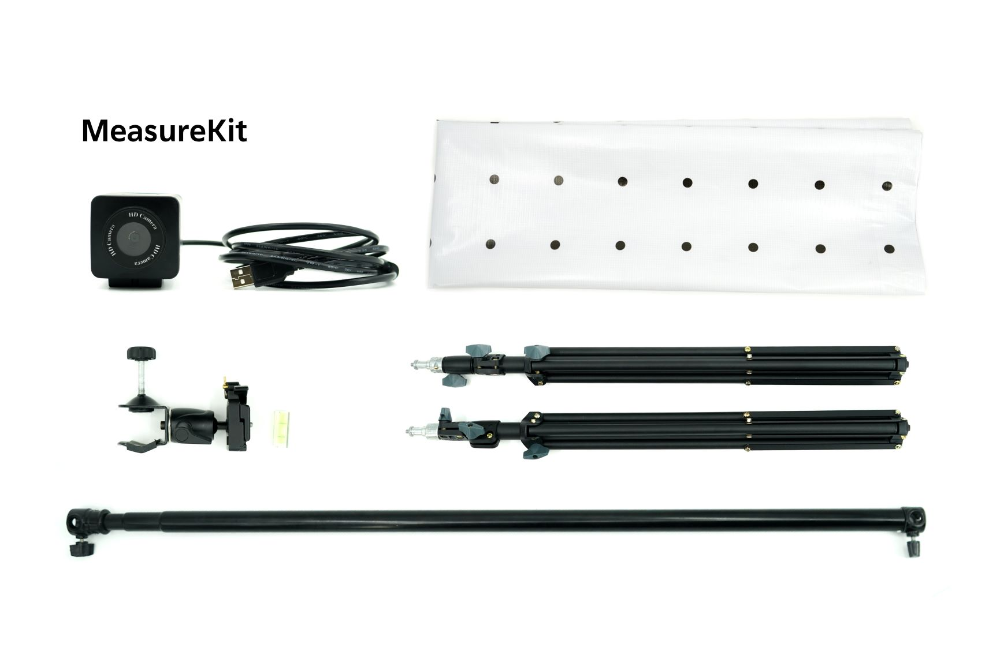
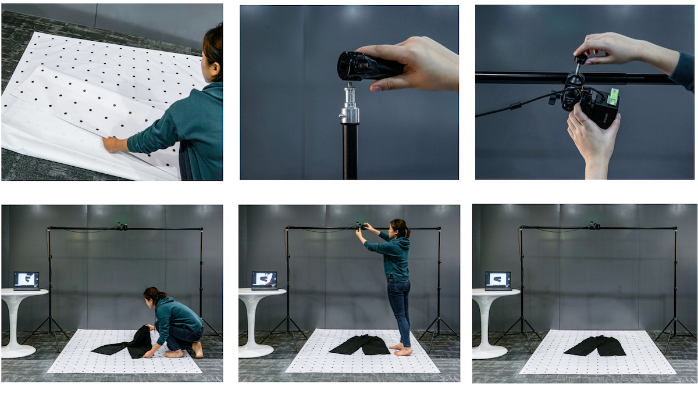

# MeasureKit

MeasureKit is a simple package containing everything you need to measure garments with MeasureAI.

Take pictures by laying the background mat on flat surface, and place garment flat on the mat.

MeasureAI will automatically detect the background mat and perform calibration to adjust for camera angles.

## Setup

#### Mobile

MeasureAI can be used with any modern smartphone. Just login to [MeasureAI](https://measure.productai.com/measure) from your Android or iOS device.

1. Lay Background Mat on a flat surface. It's easiest to place this on the floor. Place clothing on top of the Background Mat. See [Taking Photos](measurekit.md#taking-photos) for correct placement.
2. Login to to [MeasureAI](https://measure.productai.com/measure). 
3. Tap `Upload Photo` to take a picture with your smartphone. 
4. Click `Submit` and wait for MeasureAI to return results. 

#### Desktop

MeasureKit comes with a USB Webcam, and a stand for using with a desktop or laptop PC.

1. Plug USB Webcam into a Windows PC or Mac OSX system. 
2. Lay Background Mat on a flat surface. It's easiest to place this on the floor. Place clothing on top of the Background Mat. See [Taking Photos](measurekit.md#taking-photos) for correct placement.
3. Install Camera Stand above Background Mat, positioned to either side of the mat. 
4. Attach clamp to the cross bar of the Camera Stand. 
5. Clamp USB Webcam, and position so that the camera can take pictures directly above the mat. 
6. Login to to [MeasureAI](https://measure.productai.com/measure). 
7. Click `Take Photo` to take a picture with your smartphone.
8. Click `Submit` and wait for MeasureAI to return results. 

## Package Contents

#### 1. USB Webcam

Just plug into any Windows PC or Mac OSX system.

#### 2. Camera Stand

Customized stand for attaching USB webcam to optimized position.

#### 3. Background Mat

Lightweight and reusable background mat for taking photos.

* Designed to reduce lighting glare. 
* Comes in S / M / L sizes. 

### Product Specs

| Item | Specification | Notes |
| :--- | :--- | :--- |
| Camera Resolution | 5MP | USB Webcam |
| Background Mat \(S\) | 100 X 140 CM | Suitable for short sleeve tops, shorts.  Size M or smaller trousers. |
| Background Mat \(M\) | 150 X 200 CM | Recommended for most clothing |
| Background Mat \(L\) | 200 X 270 CM | Extra-large clothing |

### Requirements

| Requirement | Description |
| :--- | :--- |
| Lighting | Indoor lighting. |
| Operating System | Windows PC or Mac OSX.  Recommend Chrome browser for best results. |

